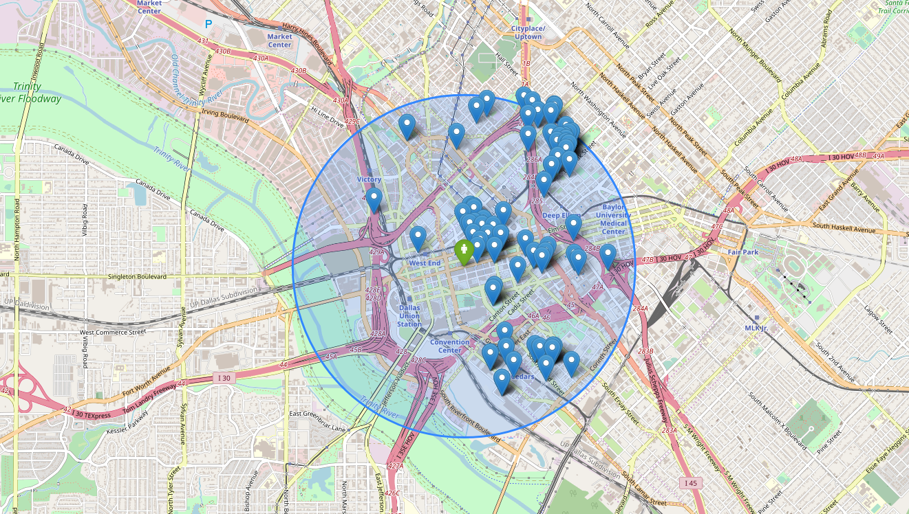

# Find the perfect place to stay in Texas!

<p align="center">

</p>

The goal of this project consists in buiding a search engine over a data base of Airbnb houses.

The code returns the houses of the data base which matches the descriptions entered by an user query. User query means the sentence an user enter in a search field, for example: "A beuatiful house with beach and garden".

This project is mostly related to text-mining, where some metrics and tools for computing text similarity score ranking were used.

____
# Data
*The data used are available on the Kaggle challeng [Airbnb Property Data from Texas](https://www.kaggle.com/PromptCloudHQ/airbnb-property-data-from-texas).

____

## Create documents
* Dealing with different files it's an important task in Data Mining. For this purpose, we create a `.tsv` file for each record of the dataset. The content of the file is as following:

    ```
    average_rate_per_night \t  bedrooms_count \t city \t date_of_listing \t description \t latitude\t longitude \t title \t url
    ```
   
    __Example__:
  
    ```
    20$      4       Humble     May 2016        stylish and beautiful apartment etc etc..      40.2        17.02       River house        www.airbnb.com/19281 
    ```   
____

## Search Engine

Now, we want to create two different Search Engines that, given as input a query, return the houses that match the query.

As a first common step, we process the documents by

1. Removing stopwords
2. Removing punctuation
3. Stemming
4. Anything else you think it's needed

For this purpose, we use the [nltk library](https://www.nltk.org/).

### 3.1) Conjunctive query
At this moment, we narrow out interest on the `description` and `title` of each document. It means that the first Search Engine will evaluate queries with respect to the aforementioned information.

#### 3.1.1) Index creation!

Creating the Inverted Index. It will be a dictionary of this format:

```
{
term_id_1:[document_1, document_2, document_4],
term_id_2:[document_1, document_3, document_5, document_6],
...}
```

where _document\_i_ is the *id* of a document that contains the word.


#### 3.1.2) Query execution
Given a query, that you let the user enter:

```
a beautiful house with garden and beach
```
the Search Engine will return a list of documents.

##### What documents do we want?
Since we are dealing with conjunctive queries (AND), each of the returned documents should contain all the words in the query.
The final output of the query will return, if present, the following information for each of the selected documents:

* Title
* Description
* City
* Url

__Example Output__:

|                        Title                       |                                                                                                 Description                                                                                                 |     City    |                                 Url                                 |
|:--------------------------------------------------:|:-----------------------------------------------------------------------------------------------------------------------------------------------------------------------------------------------------------:|:-----------:|:-------------------------------------------------------------------:|
|   2 Private rooms/bathroom 10min from IAH airport  | Welcome to stay in private room with queen bed and detached private bathroom on the second floor. Another private bedroom with sofa bed is available for additional guests. 10$ for an additional guest.... |    Humble   |   https://www.airbnb.com/rooms/18520444?location=Cleveland%2C%20TX  |
| Unique Location! Alamo Heights - Designer Inspired | Stylish, fully remodeled home in upscale NW – Alamo Heights Area. \n\nAmazing location - House conveniently located in quiet street, with beautiful seasoned trees, prestigious neighborhood and very cl... | San Antonio |    https://www.airbnb.com/rooms/17481455?location=Cibolo%2C%20TX    |
|              River house near the city             |                                 'River house on island close to the city' \nA well maintained river house off the San Jacinto river with extra room for temporary visitors.                                 |   Houston   | https://www.airbnb.com/rooms/16926307?location=Beach%20City%2C%20TX |


### 3.2) Conjunctive query & Ranking score
In this other Search Engine, given a query, we want to get the *top-k* (the choice of *k* it's up to you!) documents related to the query. In particular:

* Find all the documents that contains all the words in the query (as before...).
* Sort them by their similarity with the query
* Return in output *k* documents, or all the documents with non-zero similarity with the query when the results are less than _k_. You __must__ using a heap data structure for maintaining the *top-k* documents.

This is done with the help of two information retrieval units: *tfIdf* score, and the _Cosine similarity_.

#### 3.2.1) Inverted index
Your second Inverted Index is of this format:

```
{
term_id_1:[(document1, tfIdf_{term,document1}), (document2, tfIdf_{term,document2}), (document4, tfIdf_{term,document4}), ...],
term_id_2:[(document1, tfIdf_{term,document1}), (document3, tfIdf_{term,document3}), (document5, tfIdf_{term,document5}), (document6, tfIdf_{term,document6}), ...],
...}
```

Practically, for each word we want the list of documents in which it is contained in, and the relative *tfIdf* score.
*tfIdf* values are invariant with respect to the query, for this reason we can precalculate them.

#### 3.2.2) Execute the query

Once we got the right set of documents, we want to know which are the most similar according to the query. For this purpose, as scoring function we will use the Cosine Similarity with respect to the *tfIdf* representations of the documents.

Given a query, that you let the user enter:
```
a beautiful house with garden and beach
```
the Search Engine will return a list of documents, __ranked__ by their Cosine Similarity with respect to the query entered in input.

More precisely, the output contains:
* Title
* Description
* City
* Url
* The similarity score of the documents with respect to the query

__Example Output__:

|                        Title                       |                                                                                                 Description                                                                                                 |     City    |                                 Url                                 | Similarity |
|:--------------------------------------------------:|:-----------------------------------------------------------------------------------------------------------------------------------------------------------------------------------------------------------:|:-----------:|:-------------------------------------------------------------------:|:----------:|
|   2 Private rooms/bathroom 10min from IAH airport  | Welcome to stay in private room with queen bed and detached private bathroom on the second floor. Another private bedroom with sofa bed is available for additional guests. 10$ for an additional guest.... |    Humble   |   https://www.airbnb.com/rooms/18520444?location=Cleveland%2C%20TX  |    0.96    |
| Unique Location! Alamo Heights - Designer Inspired | Stylish, fully remodeled home in upscale NW – Alamo Heights Area. \n\nAmazing location - House conveniently located in quiet street, with beautiful seasoned trees, prestigious neighborhood and very cl... | San Antonio |    https://www.airbnb.com/rooms/17481455?location=Cibolo%2C%20TX    |    0.92    |
|              River house near the city             |                                 'River house on island close to the city' \nA well maintained river house off the San Jacinto river with extra room for temporary visitors.                                 |   Houston   | https://www.airbnb.com/rooms/16926307?location=Beach%20City%2C%20TX |    0.87    |

____

## Visualization

An important feature of Airbnb, it's the search on the map. Here we want to try to recreate a similar tool!

Our tool will work in the following way:

1. Takes in input a set of coordinates, e.g: [32.779594, -96.800768], and a maximum distance from the coordinates, e.g.: 10km.
2. Generate a map, with a circle of the given radius, where the center is represented by the coordinates given in input.
3. Shows the houses that are inside the circle of the given radius.

Here a small example, with all the houses far at most 2km from the 7-Eleven in Commerce St, Dallas:




<p align="center">

</p>
